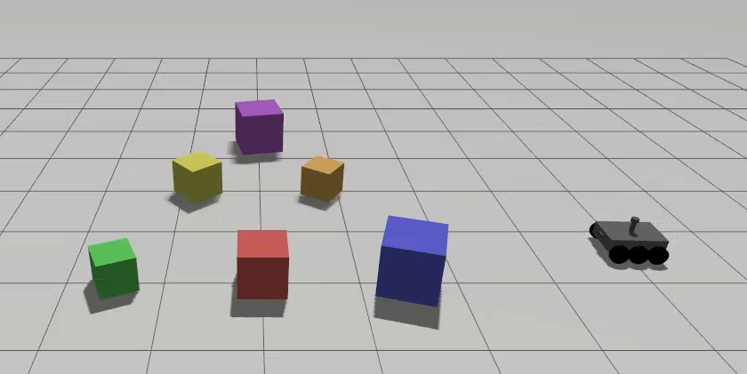

# Controlling a simulated UGV in Gazebo using AWS IoT Core & ROS 2

This project demonstrates remote control of a ROS 2 Gazebo UGV through **AWS IoT Core MQTT**.

The system uses an AWS IoT Core MQTT topic to send velocity commands to a local Ubuntu computer. The local computer receives the MQTT message and converts it into a ROS 2 `Twist` message published to `/cmd_vel`.



## 1. Prerequisites

### Hardware

* Ubuntu 24.04 
* Internet connection
* An AWS account

No physical robot is required. The current implementation controls a simulated UGV in Gazebo.

### Software

The project was developed using:

* Ubuntu
* ROS 2 Jazzy
* Gazebo
* Python 3
* AWS CLI
* AWS IoT Device SDK for Python v2
* Git
* VS Code 

ROS 2 Jazzy and Gazebo should be installed before setting up this package.

Verify ROS 2:

```bash
ros2 --version
```

Verify Python:

```bash
python3 --version
```

Verify AWS CLI:

```bash
aws --version
```

### AWS Account

An AWS account with permission to create and configure:

* AWS IoT Things
* IoT certificates
* IoT policies
* IoT Core MQTT connections

is required.

---

# 2. Project Structure

The relevant project structure is:

```text
ugv_robot/
├── certs/
│   ├── AmazonRootCA1.pem
│   ├── <certificate-id>-certificate.pem.crt
│   ├── <certificate-id>-private.pem.key
│   └── <certificate-id>-public.pem.key
│
├── config/
├── include/
├── launch/
├── myenv/
├── rviz/
├── scripts/
│   ├── send_velocity.py
│   ├── test_mqtt.py
│   └── iot_cmd_vel_bridge.py
│
├── src/
├── urdf/
├── worlds/
├── CMakeLists.txt
├── package.xml
└── requirements.txt
```
---

# 3. Create AWS IoT Core Resources

Open AWS IoT Core in the AWS Console.

Use the desired AWS region. This project uses:

```text
ap-southeast-2
```

## 3.1 Create an IoT Thing

Create a Thing named:

```text
UGV-Simulation
```

---

## 3.2 Create a Certificate

Create a new certificate using the AWS IoT Core certificate creation workflow.

Download:

```text
Device certificate
Private key
Public key
Amazon Root CA 1
```

Place the downloaded files in:

```bash
~/ugv_ws/src/ugv_robot/certs/
```

The directory should contain:

```text
AmazonRootCA1.pem
<certificate-id>-certificate.pem.crt
<certificate-id>-private.pem.key
<certificate-id>-public.pem.key
```

Protect the private key:

```bash
chmod 600 ~/ugv_ws/src/ugv_robot/certs/*-private.pem.key
```

---

# 4. Create the IoT Policy

Create an AWS IoT policy named:

```text
UGVSimulationPolicy
```

For development/testing, the policy can use:

```json
{
  "Version": "2012-10-17",
  "Statement": [
    {
      "Effect": "Allow",
      "Action": "iot:Connect",
      "Resource": "*"
    },
    {
      "Effect": "Allow",
      "Action": "iot:Subscribe",
      "Resource": "*"
    },
    {
      "Effect": "Allow",
      "Action": "iot:Receive",
      "Resource": "*"
    },
    {
      "Effect": "Allow",
      "Action": "iot:Publish",
      "Resource": "*"
    }
  ]
}
```

> For production, restrict the resources and MQTT topics rather than using `"Resource": "*"`.

---

# 5. Attach the Certificate

Attach the certificate to:

```text
UGVSimulationPolicy
```

and attach the certificate to the Thing:

```text
UGV-Simulation
```

The relationship should be:

```text
UGV-Simulation
      │
      ▼
Certificate
      │
      ▼
UGVSimulationPolicy
```

---

# 6. Get the AWS IoT Endpoint

Run:

```bash
aws iot describe-endpoint \
    --endpoint-type iot:Data-ATS \
    --region ap-southeast-2
```

The result will look similar to:

```text
xxxxxxxxxxxx-ats.iot.ap-southeast-2.amazonaws.com
```

Set it as an environment variable:

```bash
export AWS_IOT_ENDPOINT="xxxxxxxxxxxx-ats.iot.ap-southeast-2.amazonaws.com"
```

Verify:

```bash
echo $AWS_IOT_ENDPOINT
```

For convenience, the export command can be added to your shell configuration, although storing the endpoint in a `.env` file is also possible.

---

# 7. Create the Python Virtual Environment

Navigate to the package:

```bash
cd ~/ugv_ws/src/ugv_robot
```

Create the virtual environment:

```bash
python3 -m venv myenv
```

Activate it:

```bash
source myenv/bin/activate
```

Verify:

```bash
which python
```

It should point to:

```text
~/ugv_ws/src/ugv_robot/myenv/bin/python
```

---

# 8. Install Python Requirements

The project contains a:

```text
requirements.txt
```

file.

Its contents should be:

```text
# AWS IoT Core MQTT
awsiotsdk

# ROS 2 Python runtime dependencies used by rclpy
numpy
PyYAML
```

Install the dependencies:

```bash
cd ~/ugv_ws/src/ugv_robot
source myenv/bin/activate

pip install -r requirements.txt
```

Verify the important Python modules:

```bash
python -c "import awsiot; import awscrt; import numpy; import yaml; import rclpy; print('All Python dependencies OK')"
```

Expected:

```text
All Python dependencies OK
```

### Why NumPy and PyYAML are included

Although the AWS MQTT bridge itself primarily requires `awsiot` and `awscrt`, ROS 2 Jazzy's Python libraries require additional Python packages.

For example:

```text
rclpy
 └── rosgraph_msgs
      └── numpy

rclpy
 └── parameter handling
      └── PyYAML
```

Without these packages, the bridge can fail with:

```text
ModuleNotFoundError: No module named 'yaml'
```

or:

```text
ModuleNotFoundError: No module named 'numpy'
```

---

# 9. Configure the ROS 2 Package

The package is a CMake-based ROS 2 package.

The Python scripts are installed using:

```cmake
install(
  PROGRAMS
    scripts/send_velocity.py
    scripts/iot_cmd_vel_bridge.py
  DESTINATION lib/${PROJECT_NAME}
)
```
---

# 10. Build the ROS 2 Workspace

From the workspace:

```bash
cd ~/ugv_ws
```

Source ROS 2:

```bash
source /opt/ros/jazzy/setup.bash
```

Build the package:

```bash
colcon build --packages-select ugv_robot
```

Then source the workspace:

```bash
source install/setup.bash
```

Verify the executables:

```bash
ros2 pkg executables ugv_robot
```

You should see entries similar to:

```text
ugv_robot iot_cmd_vel_bridge.py
ugv_robot send_velocity.py
```

---

# 11. Verify the Gazebo UGV

Start the Gazebo UGV simulation using the project's normal launch/world configuration.

Check that `/cmd_vel` exists:

```bash
ros2 topic list | grep cmd_vel
```

Check the topic:

```bash
ros2 topic info /cmd_vel
```

The UGV should already respond to the local ROS 2 velocity command:

```bash
ros2 run ugv_robot send_velocity.py \
    --linear 0.3 \
    --angular 0.0 \
    --duration 2.0
```

This confirms that:

```text
ROS 2 → /cmd_vel → Gazebo UGV
```

works before introducing AWS IoT.

---

# 12. Test AWS IoT MQTT Separately

Before testing the ROS 2 bridge, test the AWS MQTT connection.

The project contains:

```text
scripts/test_mqtt.py
```

Run:

```bash
cd ~/ugv_ws/src/ugv_robot
source myenv/bin/activate

python scripts/test_mqtt.py
```

The script should connect to AWS IoT Core and subscribe to:

```text
ugv/test
```

Expected output:

```text
Connecting to AWS IoT...
Connected!
Subscribed to ugv/test
Waiting for messages...
```

From the AWS IoT Core MQTT test client, publish:

Topic:

```text
ugv/test
```

Payload:

```json
{
  "hello": "UGV"
}
```

The local terminal should receive:

```text
Received message:
  topic: ugv/test
  payload: {
    "hello": "UGV"
  }
```

This confirms:

```text
AWS IoT Core
      │
      │ MQTT/TLS
      ▼
Ubuntu PC
```

is working.

Stop the test script before running the ROS bridge:

```text
Ctrl+C
```

---

# 13. AWS → ROS 2 Command Bridge

The main bridge is:

```text
scripts/iot_cmd_vel_bridge.py
```

It subscribes to:

```text
ugv/cmd_vel
```

and converts incoming JSON commands into ROS 2 `Twist` messages.

The expected MQTT message format is:

```json
{
  "linear": 0.3,
  "angular": 0.0,
  "duration": 2.0
}
```

The fields represent:

| Field      | Description                      |
| ---------- | -------------------------------- |
| `linear`   | Forward/backward velocity in m/s |
| `angular`  | Rotational velocity in rad/s     |
| `duration` | Command duration in seconds      |

---

# 14. Run the ROS 2 MQTT Bridge

Open a terminal and run:

```bash
cd ~/ugv_ws

source /opt/ros/jazzy/setup.bash
source install/setup.bash
source ~/ugv_ws/src/ugv_robot/myenv/bin/activate

export AWS_IOT_ENDPOINT="YOUR_AWS_IOT_ENDPOINT"

ros2 run ugv_robot iot_cmd_vel_bridge.py
```

Expected output:

```text
Connecting to AWS IoT: ...
Connected to AWS IoT Core
Subscribed to ugv/cmd_vel
```

The bridge is now waiting for MQTT commands.

---

# 15. Send a Command from AWS IoT Core

Open:

```text
AWS IoT Core → MQTT test client
```

Publish to:

```text
ugv/cmd_vel
```

with:

```json
{
  "linear": 0.3,
  "angular": 0.0,
  "duration": 2.0
}
```

The bridge should report something similar to:

```text
Received MQTT command:
{'linear': 0.3, 'angular': 0.0, 'duration': 2.0}

Published /cmd_vel:
linear.x=0.30, angular.z=0.00

Robot stopped
```

The Gazebo UGV should move forward for approximately two seconds and then stop.

The complete data flow is now:

```text
AWS IoT Core
     │
     │ MQTT/TLS
     ▼
ugv/cmd_vel
     │
     ▼
iot_cmd_vel_bridge.py
     │
     │ geometry_msgs/Twist
     ▼
/cmd_vel
     │
     ▼
Gazebo UGV
```

---

# 16. Safety Limits

The bridge limits incoming commands to:

```text
Linear velocity:
-1.0 to +1.0 m/s

Angular velocity:
-1.5 to +1.5 rad/s
```

Commands exceeding these values are automatically clamped.

For example:

```json
{
  "linear": 5.0,
  "angular": 0.0,
  "duration": 2.0
}
```

will be limited to:

```text
linear.x = 1.0 m/s
```

The `duration` parameter also provides an automatic stop after the requested command duration.

---

# 17. Stopping the System

To stop the ROS 2 MQTT bridge:

```text
Ctrl+C
```

To stop Gazebo:

```text
Ctrl+C
```

If `test_mqtt.py` is running:

```text
Ctrl+C
```

Stopping these processes does not delete the AWS IoT resources.

The following AWS resources can remain configured for future testing:

```text
UGV-Simulation
Certificate
UGVSimulationPolicy
AWS IoT Core endpoint
```

They can be reused the next time the project is started.

---

# 18. Starting the Project Again

When returning to the project, the basic startup sequence is:

### Terminal 1 — Gazebo

Start the Gazebo UGV simulation.

### Terminal 2 — ROS 2 + AWS bridge

```bash
cd ~/ugv_ws

source /opt/ros/jazzy/setup.bash
source install/setup.bash
source ~/ugv_ws/src/ugv_robot/myenv/bin/activate

export AWS_IOT_ENDPOINT="YOUR_AWS_IOT_ENDPOINT"

ros2 run ugv_robot iot_cmd_vel_bridge.py
```

Then publish commands through AWS IoT Core:

Topic:

```text
ugv/cmd_vel
```

Example:

```json
{
  "linear": 0.3,
  "angular": 0.0,
  "duration": 2.0
}
```

---

# 19. Troubleshooting

## `ModuleNotFoundError: No module named 'yaml'`

Activate the virtual environment:

```bash
source ~/ugv_ws/src/ugv_robot/myenv/bin/activate
```

Install:

```bash
pip install PyYAML
```

Or reinstall all requirements:

```bash
pip install -r ~/ugv_ws/src/ugv_robot/requirements.txt
```

---

## `ModuleNotFoundError: No module named 'numpy'`

Install:

```bash
pip install numpy
```

Or:

```bash
pip install -r ~/ugv_ws/src/ugv_robot/requirements.txt
```

---

## CMake `RENAME` error

If you see:

```text
_install PROGRAMS given RENAME option with more than one file
```

make sure the Python installation section is:

```cmake
install(
  PROGRAMS
    scripts/send_velocity.py
    scripts/iot_cmd_vel_bridge.py
  DESTINATION lib/${PROJECT_NAME}
)
```

Then rebuild:

```bash
cd ~/ugv_ws
colcon build --packages-select ugv_robot
source install/setup.bash
```

---

## AWS IoT connection fails

Check:

```bash
echo $AWS_IOT_ENDPOINT
```

Make sure it contains the correct AWS IoT Data ATS endpoint.

Also check the certificate files:

```bash
ls ~/ugv_ws/src/ugv_robot/certs
```

The directory should contain:

```text
AmazonRootCA1.pem
*-certificate.pem.crt
*-private.pem.key
*-public.pem.key
```

---

## MQTT messages are not received

Check that the topic is exactly:

```text
ugv/cmd_vel
```

and the payload is valid JSON:

```json
{
  "linear": 0.3,
  "angular": 0.0,
  "duration": 2.0
}
```

Also make sure `test_mqtt.py` is not running simultaneously with the bridge using the same MQTT client ID.

---

# 20. Development Notes

The project deliberately separates the system into three components:

```text
AWS IoT Core
    ↓
MQTT communication
    ↓
ROS 2 bridge
    ↓
Gazebo simulation
```

This allows each layer to be tested independently:

### Test 1 — Gazebo / ROS 2

```bash
ros2 run ugv_robot send_velocity.py \
    --linear 0.3 \
    --angular 0.0 \
    --duration 2.0
```

### Test 2 — AWS IoT / MQTT

```bash
python scripts/test_mqtt.py
```

### Test 3 — Full system

```bash
ros2 run ugv_robot iot_cmd_vel_bridge.py
```

followed by an AWS IoT MQTT command.

This separation makes debugging significantly easier because failures can be isolated to the Gazebo, ROS 2, MQTT, or AWS layer.

---

# 21. AWS Cost Considerations

The current architecture does not require a continuously running EC2 instance.

The local computer runs:

```text
ROS 2
Gazebo
MQTT bridge
```

while AWS IoT Core provides the MQTT communication layer.

When finished testing, stop:

```text
ROS 2 bridge
Gazebo
MQTT test scripts
```

with `Ctrl+C`.

There is no need to delete the AWS IoT Thing, certificate, or policy just to stop the local simulation.

For production use, AWS IoT policies should also be restricted to the required Thing and MQTT topics rather than using wildcard resources.

---

# 22. Quick Reference

### Activate environment

```bash
cd ~/ugv_ws/src/ugv_robot
source myenv/bin/activate
```

### Install dependencies

```bash
pip install -r requirements.txt
```

### Build

```bash
cd ~/ugv_ws
source /opt/ros/jazzy/setup.bash
colcon build --packages-select ugv_robot
source install/setup.bash
```

### Set AWS endpoint

```bash
export AWS_IOT_ENDPOINT="YOUR_AWS_IOT_ENDPOINT"
```

### Run MQTT test

```bash
python ~/ugv_ws/src/ugv_robot/scripts/test_mqtt.py
```

### Run AWS → ROS 2 bridge

```bash
ros2 run ugv_robot iot_cmd_vel_bridge.py
```

### Test ROS 2 directly

```bash
ros2 run ugv_robot send_velocity.py \
    --linear 0.3 \
    --angular 0.0 \
    --duration 2.0
```

### MQTT command topic

```text
ugv/cmd_vel
```

### MQTT command

```json
{
  "linear": 0.3,
  "angular": 0.0,
  "duration": 2.0
}
```
